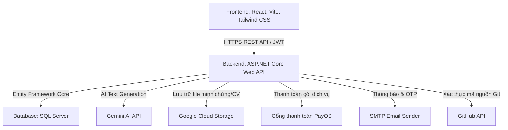
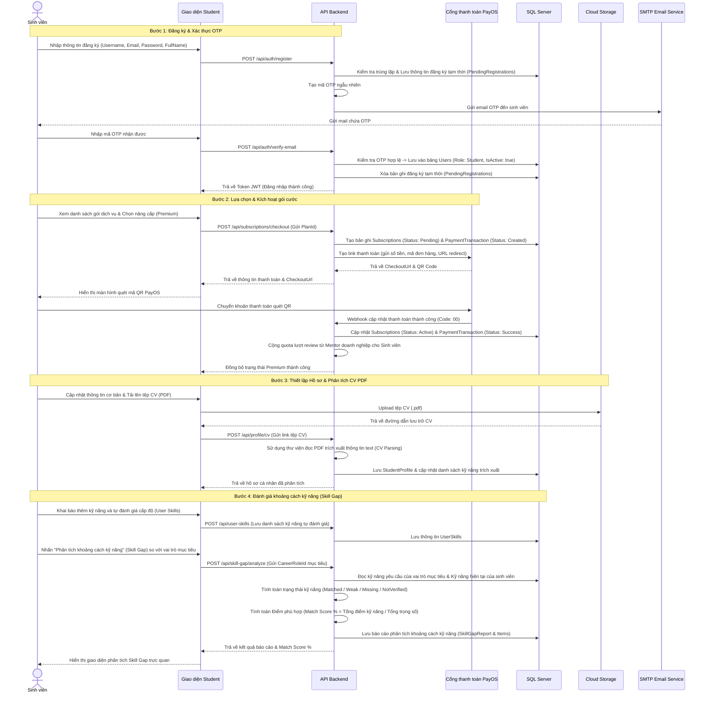
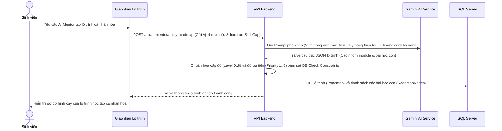
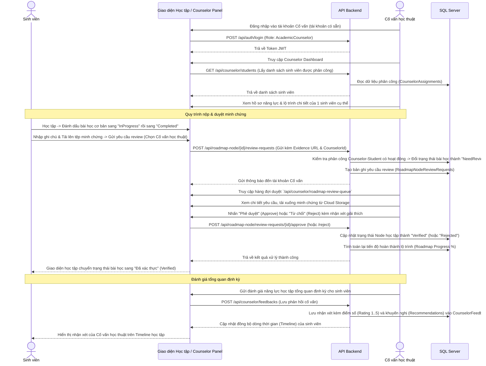
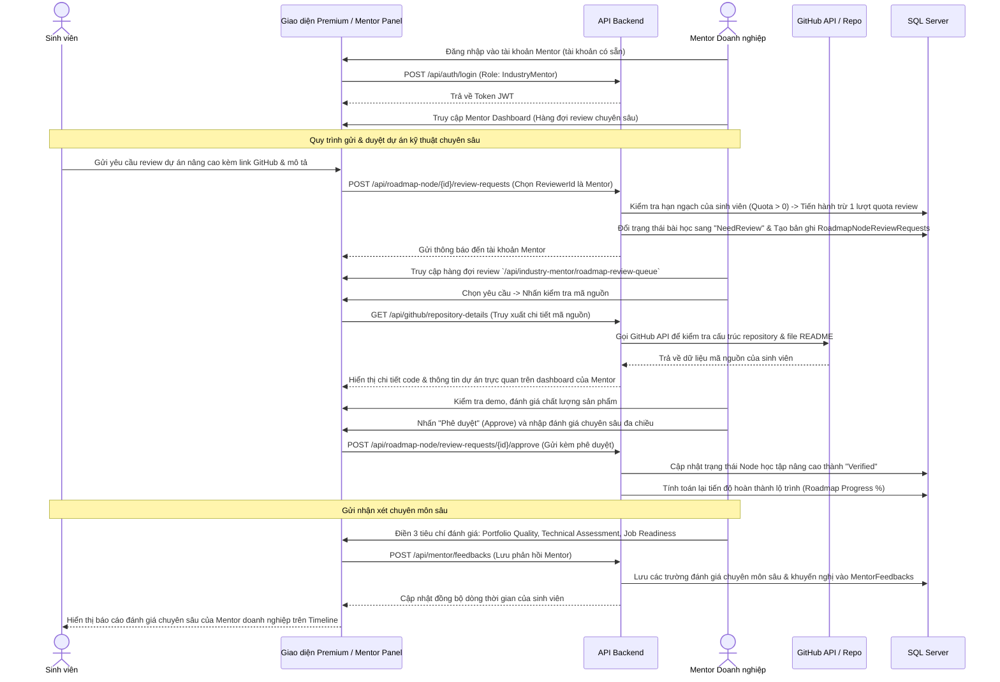
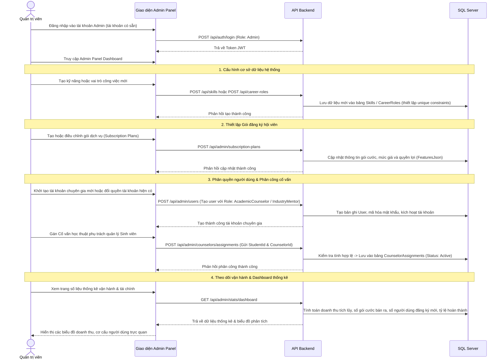

# TÀI LIỆU PHÂN TÍCH & THIẾT KẾ HỆ THỐNG
## CAREERMAP - HỆ THỐNG HOẠCH ĐỊNH LỘ TRÌNH HỌC TẬP VÀ KẾT NỐI CỐ VẤN

Tài liệu này chi tiết hóa bối cảnh, các vấn đề cốt lõi, giải pháp công nghệ và **5 Luồng nghiệp vụ chính** sắp xếp theo trình tự thời gian (chronological order). Tài liệu bao phủ toàn diện hoạt động của cả **4 Vai trò người dùng (Student, Academic Counselor, Industry Mentor, Admin)** bám sát mã nguồn thực tế của dự án.

---

## 1. BỐI CẢNH DỰ ÁN (CONTEXT)

Trong kỷ nguyên số, sinh viên ngành Công nghệ thông tin và các ngành kỹ thuật đối mặt với lượng kiến thức khổng lồ nhưng lại thiếu định hướng rõ ràng. Họ thường gặp khó khăn trong việc xác định những kỹ năng thực tế mà doanh nghiệp yêu cầu và cách tự đánh giá năng lực bản thân.

**CareerMap** ra đời như một nền tảng hỗ trợ sinh viên:
*   Định vị bản thân thông qua việc so sánh kỹ năng hiện tại với yêu cầu của vị trí công việc mong muốn.
*   Tự động xây dựng lộ trình học tập cá nhân hóa được hỗ trợ bởi trí tuệ nhân tạo (AI Mentor).
*   Kết nối trực tiếp với **Cố vấn học thuật (Academic Counselor)** và **Mentor doanh nghiệp (Industry Mentor)** để kiểm tra năng lực và xác thực kỹ năng thông qua minh chứng thực tế (evidence-based learning).

---

## 2. CÁC VẤN ĐỀ CỐT LÕI (PROBLEMS)

Hệ thống giải quyết các vấn đề thực tiễn sau:
1.  **Thiếu định hướng lộ trình học tập:** Sinh viên không biết bắt đầu học từ đâu và học những gì để đạt được vị trí công việc mơ ước (ví dụ: Backend Engineer, React Developer, DevOps, v.v.).
2.  **Mơ hồ về khoảng cách năng lực (Skill Gap):** Sinh viên không biết mình đang thiếu hụt những kỹ năng nào và mức độ thiếu hụt là bao nhiêu so với tiêu chuẩn tuyển dụng.
3.  **Kỹ năng thiếu tính xác thực:** Việc ghi kỹ năng vào CV chỉ mang tính chủ quan, thiếu minh chứng thực tế (như link git, mã nguồn, bài báo cáo) được kiểm chứng bởi chuyên gia.
4.  **Thiếu kết nối với Mentor/Counselor:** Sinh viên khó tiếp cận và nhận phản hồi trực tiếp, chi tiết từ các cố vấn học thuật trong trường hoặc các kỹ sư có kinh nghiệm tại doanh nghiệp.
5.  **Quá tải trong công tác quản lý của cố vấn:** Giảng viên/Cố vấn khó theo dõi tiến độ học tập chi tiết của hàng trăm sinh viên một cách trực quan.

---

## 3. GIẢI PHÁP HỆ THỐNG (SOLUTION)

Nền tảng **CareerMap** cung cấp một giải pháp toàn diện bao gồm:
*   **Phân tích khoảng cách kỹ năng (Skill Gap Analysis):** Đối chiếu các kỹ năng hiện tại của học sinh với yêu cầu của vai trò mục tiêu để tính toán Điểm phù hợp (Match Score %) và đưa ra khuyến nghị học tập.
*   **Lộ trình học tập động (Dynamic Roadmap):** Tạo các module học tập phân cấp (Group & Module) có thứ tự ưu tiên và liên kết chặt chẽ với các tài nguyên học tập (Learning Resources).
*   **Hệ thống Đánh giá & Xác thực (Verification Queue):** Sinh viên nộp minh chứng (Evidence URL, file Zip, PDF hoặc link Github). Cố vấn học thuật hoặc Mentor doanh nghiệp sẽ phê duyệt trực tuyến, chấm điểm và gửi phản hồi chi tiết.
*   **AI Mentor tích hợp:** Trợ lý AI (dựa trên mô hình Gemini) phân tích hồ sơ và tự động sinh ra lộ trình học cá nhân hóa bám sát thực tế.

---

## 4. KIẾN TRÚC & CÔNG NGHỆ (ARCHITECTURE & TECH STACK)

CareerMap được triển khai dựa trên kiến trúc Web API kết hợp Single Page Application:

---

## 5. CÁC VAI TRÒ NGƯỜI DÙNG & TÍNH NĂNG (ACTORS & FEATURES)

### 5.1. Sinh viên (Student)
*   **Khởi tạo tài khoản:** Tự đăng ký trực tuyến, xác thực địa chỉ email qua OTP và đăng nhập vào hệ thống.
*   **Quản lý gói dịch vụ (Subscriptions):** Lựa chọn và nâng cấp gói dịch vụ (Free/Premium) qua PayOS để lấy hạn ngạch (quota) kết nối và review với Mentor doanh nghiệp.
*   **Quản lý hồ sơ (Profile):** Cập nhật trường học, chuyên ngành, GPA, tải lên CV (PDF) để hệ thống tự động phân tích và trích xuất kỹ năng (CV Parsing).
*   **Quản lý kỹ năng (User Skills):** Thêm kỹ năng cá nhân, tự đánh giá cấp độ (Beginner, Intermediate, Advanced) và đính kèm link minh chứng.
*   **Đánh giá khoảng cách kỹ năng (Skill Gap):** Đối chiếu với yêu cầu của vị trí công việc mục tiêu (Target Career Role) để tính toán Điểm phù hợp (Match Score %).
*   **Tạo lộ trình học tập:** Yêu cầu AI Mentor phân tích sinh lộ trình học tập cá nhân hóa hoặc tạo lộ trình tiêu chuẩn theo nghề nghiệp.
*   **Gửi yêu cầu Review:** Nộp minh chứng bài học (link Github, file demo) và gửi yêu cầu kiểm duyệt đến Cố vấn học thuật (cho bài học cơ bản) hoặc Mentor doanh nghiệp (cho dự án nâng cao).

### 5.2. Cố vấn học thuật (Academic Counselor)
*   **Đăng nhập hệ thống:** Sử dụng tài khoản được cung cấp sẵn (hoặc tài khoản được Admin gán quyền `AcademicCounselor`).
*   **Quản lý danh sách sinh viên:** Theo dõi tiến độ lộ trình học tập của các sinh viên được phân công.
*   **Duyệt lộ trình học tập:** Tiếp nhận yêu cầu review các node học tập cơ bản, xem minh chứng, quyết định Phê duyệt (Approve) hoặc Từ chối (Reject) kèm lý do chi tiết.
*   **Đánh giá tổng quan:** Gửi nhận xét học thuật và điểm số (Rating 1..5) định kỳ (Counselor Feedback) hiển thị trên Timeline của sinh viên.

### 5.3. Mentor doanh nghiệp (Industry Mentor)
*   **Đăng nhập hệ thống:** Sử dụng tài khoản được cung cấp sẵn (hoặc tài khoản được Admin gán quyền `IndustryMentor`).
*   **Hàng đợi kiểm duyệt chuyên sâu (Review Queue):** Tiếp nhận yêu cầu review dự án nâng cao, đồ án kỹ thuật thực tế của sinh viên.
*   **Kiểm tra minh chứng kỹ thuật:** Kiểm tra mã nguồn (qua liên kết Github) và các minh chứng sản phẩm của sinh viên.
*   **Đánh giá năng lực chuyên môn:** Phê duyệt node nâng cao và gửi nhận xét chuyên môn sâu (Mentor Feedback) dựa trên 3 tiêu chí: Chất lượng dự án (Portfolio Quality), Đánh giá kỹ năng kỹ thuật (Technical Assessment) và Mức độ sẵn sàng làm việc (Job Readiness).

### 5.4. Quản trị viên (Admin)
*   **Đăng nhập hệ thống:** Sử dụng tài khoản quản trị hệ thống có quyền tối cao (`Admin`).
*   **Cấu hình hệ thống:** Quản lý danh mục kỹ năng (Skills), vai trò nghề nghiệp (Career Roles) và các gói cước đăng ký (Subscription Plans).
*   **Quản lý người dùng & phân quyền:** Khởi tạo tài khoản chuyên gia, cấp quyền và quản lý danh sách tài khoản (Student, Counselor, Mentor).
*   **Phân công Cố vấn:** Chỉ định cố vấn học thuật phụ trách theo dõi và kiểm duyệt lộ trình cho từng sinh viên.
*   **Theo dõi số liệu (Dashboard):** Xem thống kê tổng quan doanh thu thanh toán từ cổng PayOS, số lượng người dùng active và tỷ lệ hoàn thành lộ trình.

---

## 6. 5 QUY TRÌNH NGHIỆP VỤ CHÍNH (5 WORKFLOWS)

### 6.1. Quy trình 1: Đăng ký, Kích hoạt gói cước & Thiết lập hồ sơ Sinh viên (Student Registration, Subscription & Onboarding)
Quy trình khởi đầu của sinh viên bắt đầu từ việc đăng ký tài khoản mới, xác thực OTP email, nâng cấp gói dịch vụ qua PayOS, thiết lập hồ sơ cá nhân trích xuất từ CV, và tự đánh giá khoảng cách kỹ năng (Skill Gap).

#### Chuỗi các bước thực hiện theo mũi tên (`->`):
`Sinh viên đăng ký tài khoản mới` -> `Hệ thống gửi mã OTP xác thực qua Email` -> `Sinh viên nhập OTP để kích hoạt tài khoản` -> `Đăng nhập hệ thống` -> `Xem danh sách & Lựa chọn gói cước dịch vụ` -> `Gửi yêu cầu thanh toán (Checkout)` -> `Thực hiện giao dịch quét mã QR PayOS (đối với gói Premium)` -> `PayOS gửi Webhook báo thành công` -> `Hệ thống kích hoạt trạng thái gói Active & Cộng quota lượt review` -> `Sinh viên tải lên tệp CV (PDF)` -> `Backend trích xuất kỹ năng tự động từ CV (CV Parsing)` -> `Sinh viên tự khai báo & đánh giá cấp độ kỹ năng cá nhân (User Skills)` -> `Hệ thống thực hiện Phân tích khoảng cách kỹ năng (Skill Gap)` -> `Hiển thị Điểm phù hợp (Match Score %)` -> `Sẵn sàng tạo lộ trình học`.

#### Sơ đồ tuần tự (Sequence Diagram):

---

### 6.2. Quy trình 2: Luồng Trí tuệ Nhân tạo & Định hướng Lộ trình (AI Mentor & Career Roadmap Generation)
Giúp sinh viên tự động xây dựng lộ trình học tập cá nhân hóa được hỗ trợ bởi Trí tuệ nhân tạo Gemini AI.

#### Chuỗi các bước thực hiện theo mũi tên (`->`):
`Sinh viên yêu cầu AI Mentor sinh lộ trình học tập` -> `API Backend nhận yêu cầu & gọi Gemini AI kèm Prompt cấu trúc` -> `Gemini AI phân tích và trả về cấu trúc lộ trình (JSON gồm các nhóm module & bài học)` -> `Backend chuẩn hóa dữ liệu lộ trình (Cấp độ 0..8, thứ tự ưu tiên 1..5)` -> `Lưu lộ trình (Roadmap) và các module bài học (RoadmapNodes) vào CSDL` -> `Frontend hiển thị cây sơ đồ lộ trình học tập động cho sinh viên`.

#### Sơ đồ tuần tự (Sequence Diagram):

---

### 6.3. Quy trình 3: Quy trình của Cố vấn Học thuật (Academic Counselor Workflow)
Tương tác giữa sinh viên và Cố vấn học thuật (người đã có tài khoản sẵn và được gán quản lý sinh viên) trong việc theo dõi tiến độ, kiểm duyệt lộ trình học cơ bản và viết đánh giá định kỳ.

#### Chuỗi các bước thực hiện theo mũi tên (`->`):
`Cố vấn học thuật đăng nhập hệ thống` -> `Truy cập Counselor Dashboard xem danh sách sinh viên được phân công` -> `Xem thông tin chi tiết hồ sơ & năng lực của sinh viên` -> `Sinh viên hoàn thành bài học cơ bản và gửi yêu cầu review` -> `Cố vấn nhận yêu cầu từ hàng đợi (Review Queue)` -> `Tải xuống & Kiểm tra minh chứng bài học của sinh viên` -> `Cố vấn Phê duyệt (Approve) hoặc Từ chối (Reject) kèm lý do` -> `Hệ thống đổi trạng thái node sang Verified & tính lại tiến độ` -> `Cố vấn viết nhận xét và chấm điểm định kỳ (Counselor Feedback) hiển thị trên Timeline của sinh viên`.

#### Sơ đồ tuần tự (Sequence Diagram):

---

### 6.4. Quy trình 4: Quy trình của Mentor Doanh nghiệp (Industry Mentor Workflow)
Quy trình Mentor doanh nghiệp (người đã có tài khoản sẵn) tiếp nhận và thực hiện đánh giá chuyên môn sâu đối với các dự án nâng cao, sản phẩm thực tế của sinh viên (đã thanh toán nâng cấp Premium để có hạn ngạch review).

#### Chuỗi các bước thực hiện theo mũi tên (`->`):
`Mentor doanh nghiệp đăng nhập hệ thống` -> `Mentor quản lý hàng đợi đánh giá chuyên sâu` -> `Sinh viên gửi yêu cầu review dự án nâng cao kèm link GitHub & minh chứng chạy thử` -> `Hệ thống kiểm tra & trừ 1 lượt quota review của sinh viên` -> `Mentor nhận yêu cầu từ hàng đợi (Review Queue)` -> `Mentor truy cập GitHub kiểm tra mã nguồn (qua GitHub connection) & demo sản phẩm` -> `Mentor phê duyệt node lộ trình nâng cao` -> `Mentor viết đánh giá chuyên sâu (Mentor Feedback) theo 3 tiêu chí: Portfolio Quality (Chất lượng dự án) -> Technical Assessment (Đánh giá kỹ thuật) -> Job Readiness (Mức độ sẵn sàng công việc)` -> `Hệ thống cập nhật kết quả và hiển thị nhận xét trên Timeline của sinh viên`.

#### Sơ đồ tuần tự (Sequence Diagram):

---

### 6.5. Quy trình 5: Luồng Quản trị & Vận hành của Admin (Admin Operations Workflow)
Quy trình Quản trị viên (Admin - người có tài khoản tối cao sẵn có) thiết lập cơ sở dữ liệu hệ thống, phân quyền vai trò cho chuyên gia, thực hiện phân công cố vấn học thuật cho sinh viên và theo dõi sức khỏe kinh doanh.

#### Chuỗi các bước thực hiện theo mũi tên (`->`):
`Admin đăng nhập vào hệ thống` -> `Quản lý & Cấu hình danh mục kỹ năng (Skills) & vai trò nghề nghiệp (Career Roles)` -> `Thiết lập gói dịch vụ và mức giá (Subscription Plans)` -> `Khởi tạo tài khoản chuyên gia hoặc thay đổi vai trò (Cấp quyền AcademicCounselor hoặc IndustryMentor)` -> `Thực hiện phân công Cố vấn học thuật quản lý Sinh viên (CounselorAssignment)` -> `Xem Dashboard thống kê trực quan (Doanh thu từ PayOS, số lượng sinh viên active, tỷ lệ hoàn thành lộ trình)`.

#### Sơ đồ tuần tự (Sequence Diagram):

---

## 7. ĐÁNH GIÁ & ĐỊNH HƯỚNG PHÁT TRIỂN

### 7.1. Ưu điểm nổi bật
*   **Thiết kế luồng logic chặt chẽ:** Quy trình của sinh viên bắt đầu từ việc đăng ký, kích hoạt gói cước để có quota và quyền truy cập trước khi thiết lập hồ sơ và phân tích năng lực. Điều này bảo vệ tài nguyên hệ thống và tối ưu hóa doanh thu.
*   **Đánh giá thực chất qua minh chứng:** Thay vì tự khai báo kỹ năng mơ hồ, hệ thống xây dựng tính xác thực thông qua file đính kèm/link code được chuyên gia phê duyệt trực tiếp.
*   **Hợp nhất luồng phản hồi:** Phản hồi từ Cố vấn học thuật (lý thuyết/cơ bản) và Mentor doanh nghiệp (thực tế/chuyên sâu) được gom về một giao diện dòng thời gian, giúp sinh viên đánh giá năng lực một cách toàn diện.
*   **Tự động hóa vận hành:** Giao dịch qua QR PayOS và tính toán tiến độ tự động giúp giảm thiểu tối đa các thao tác thủ công từ phía quản trị viên.

### 7.2. Hướng phát triển nâng cao
*   **Tích hợp AI chấm code tự động:** Hỗ trợ chấm nhanh cấu trúc code Git trước khi chuyển tới Mentor để tiết kiệm thời gian của chuyên gia.
*   **Gợi ý tài nguyên học tập thông minh:** Tự động liên kết các bài học còn thiếu trong Skill Gap với các tài nguyên học tập (Learning Resources) có sẵn trong hệ thống.
*   **Kết nối nhiều cổng thanh toán:** Tích hợp thêm các cổng VNPay, MoMo bên cạnh PayOS để tăng tính tiện dụng cho người dùng khi đăng ký gói cước.
