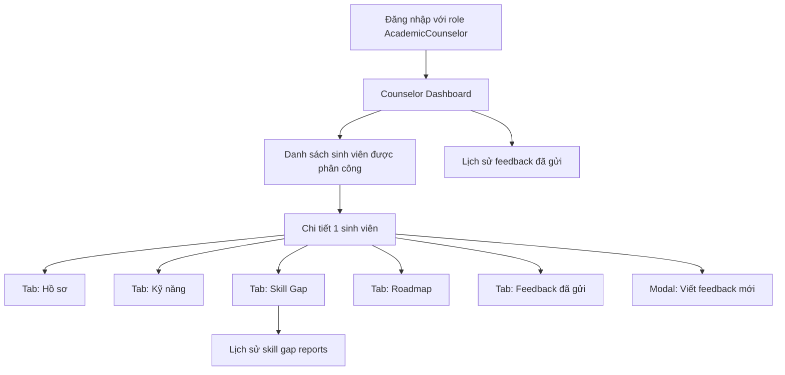

# Counselor Workspace — Tài liệu thiết kế màn hình chi tiết

> [!IMPORTANT]
> **Mục tiêu:** Thiết kế UI cho Academic Counselor (cố vấn học thuật) cho phép xem hồ sơ sinh viên được phân công, đánh giá skill gap, theo dõi roadmap, và viết feedback.
>
> **Trạng thái hiện tại:** [CounselorHome.jsx](file:///d:/PRJ/SWP/SWP-FE/src/features/counselor/CounselorHome.jsx) chỉ là placeholder 28 dòng. BE đã sẵn 13 endpoints qua [CounselorController.cs](file:///d:/PRJ/SWP/SWP-BE/Controllers/CounselorController.cs).

---

## 1. Sitemap & Navigation



---

## 2. Bố cục chung (Shell layout)

Áp dụng cùng pattern với `admin-shell` để giữ design system thống nhất. Sidebar tối, main panel sáng, sticky header.

```
┌─────────────────────────────────────────────────────────────┐
│ ┌──────────┐ ┌─────────────────────────────────────────────┐│
│ │ SIDEBAR  │ │  TOPBAR: tên user / search / notifications  ││
│ │  (260px) │ ├─────────────────────────────────────────────┤│
│ │          │ │                                             ││
│ │  Logo CM │ │  PAGE CONTENT                               ││
│ │  ─────   │ │  (dashboard / list / detail / etc.)         ││
│ │  📊 Tổng │ │                                             ││
│ │  👥 SV   │ │                                             ││
│ │  💬 Feed │ │                                             ││
│ │  ─────   │ │                                             ││
│ │  Avatar  │ │                                             ││
│ │  Logout  │ │                                             ││
│ └──────────┘ └─────────────────────────────────────────────┘│
└─────────────────────────────────────────────────────────────┘
```

### Sidebar — `.counselor-sidebar`

| Section | Item | Icon | Route |
|---|---|---|---|
| Workspace | Tổng quan | 📊 | `/counselor` |
| Workspace | Sinh viên của tôi | 👥 | `/counselor/students` |
| Workspace | Lịch sử feedback | 💬 | `/counselor/feedback` |
| Account | Hồ sơ | 👤 | `/counselor/account` |
| Account | Đăng xuất | ⏏ | (signOut) |

> [!NOTE]
> Tái sử dụng class `admin-sidebar`, `admin-nav`, `admin-account` từ [admin.css](file:///d:/PRJ/SWP/SWP-FE/src/styles/admin.css). Override màu accent để phân biệt role (gợi ý: chuyển từ blue `#0066cc` sang teal `#0891b2` cho counselor).

---

## 3. Màn 1 — Dashboard tổng quan

**Route:** `/counselor` · **Component:** `CounselorOverview.jsx`

### API gọi song song

| Endpoint | Mục đích |
|---|---|
| `GET /api/counselor/students` | Đếm tổng SV được phân công |
| `GET /api/counselor/feedback` | Lấy 5 feedback gần nhất + tổng count |

### Layout

```
┌──────────────────────────────────────────────────────────┐
│  Welcome banner: "Chào buổi chiều, {fullName}"           │
│  Subtitle: số SV đang theo dõi, số feedback tháng này    │
├──────────────────────────────────────────────────────────┤
│  KPI Row (4 cards)                                       │
│  ┌────────┐ ┌────────┐ ┌────────┐ ┌────────┐           │
│  │ Tổng SV│ │SV cần  │ │Feedback│ │Avg     │           │
│  │   23   │ │ review │ │ 12     │ │rating  │           │
│  │        │ │   5    │ │tháng   │ │ 4.3/5  │           │
│  └────────┘ └────────┘ └────────┘ └────────┘           │
├──────────────────────────────────────────────────────────┤
│  ┌─────────────────────┐ ┌──────────────────────────────┐│
│  │ Sinh viên cần chú ý │ │ Feedback gần nhất            ││
│  │ - SV có match score │ │ - Feedback ABC tới SV X      ││
│  │   thấp nhất 5       │ │ - 2 ngày trước · ★★★★☆       ││
│  │   người             │ │ ...                          ││
│  └─────────────────────┘ └──────────────────────────────┘│
└──────────────────────────────────────────────────────────┘
```

### Components

- `CounselorKpiCard` — reuse pattern từ `metric-card`
- `LowMatchScoreList` — derive từ `students` map qua latest skill gap (cần fetch từng SV → cache)
- `RecentFeedbackList` — list gọn từ `feedback` API

### Trạng thái

- **Loading:** skeleton cho 4 KPI + 2 panels
- **Empty:** "Chưa có sinh viên được phân công, vui lòng liên hệ admin"
- **Error:** toast error + retry button

---

## 4. Màn 2 — Danh sách sinh viên

**Route:** `/counselor/students` · **Component:** `CounselorStudentList.jsx`

### API

`GET /api/counselor/students` → `CounselorStudentSummaryResponse[]`

### Layout

```
┌─────────────────────────────────────────────────────────────┐
│  Page header: "Sinh viên của tôi"                           │
│  Toolbar: [🔍 Search] [Filter: status] [Sort: name/createdAt]│
├─────────────────────────────────────────────────────────────┤
│  Grid 3 cols (responsive)                                   │
│  ┌───────────┐ ┌───────────┐ ┌───────────┐                │
│  │ [Avatar]  │ │ [Avatar]  │ │ [Avatar]  │                │
│  │ Họ Tên    │ │ Họ Tên    │ │ Họ Tên    │                │
│  │ email     │ │ email     │ │ email     │                │
│  │           │ │           │ │           │                │
│  │ Match: 75%│ │ Match: -- │ │ Match: 62%│                │
│  │ Active 2d │ │ New       │ │ Active 5h │                │
│  │           │ │           │ │           │                │
│  │ [Xem]     │ │ [Xem]     │ │ [Xem]     │                │
│  └───────────┘ └───────────┘ └───────────┘                │
└─────────────────────────────────────────────────────────────┘
```

### Card spec — `.counselor-student-card`

```
┌──────────────────────────┐
│  [40px Avatar] Tên SV   ▸│  ← clickable card
│  email@school.edu        │
│  ────────────────────    │
│  🎯 Backend Developer     │  ← targetRoleName (cần fetch profile)
│  📊 Match: 75%            │  ← từ skill gap latest
│  ⏱  Cập nhật: 2 ngày      │
│                          │
│  ┌──────┐ ┌──────────┐  │
│  │ Xem  │ │ Feedback │  │
│  └──────┘ └──────────┘  │
└──────────────────────────┘
```

> [!TIP]
> Để tránh fetch n+1 (mỗi SV 1 call profile), có thể:
> - **Option A:** BE thêm field `targetRoleName` + `latestMatchScore` vào `CounselorStudentSummaryResponse`
> - **Option B:** FE fetch profile/skill-gap khi user hover/expand (lazy)
> Khuyến nghị Option A — chỉ cần update 1 query có Include.

### Tương tác

- Click card → navigate `/counselor/students/{id}`
- Click "Feedback" → mở modal viết feedback nhanh
- Search box: filter theo `fullName` + `email` client-side
- Filter chip: "Cần review" (match < 60%), "Mới" (createdAt < 7 ngày)

---

## 5. Màn 3 — Chi tiết sinh viên

**Route:** `/counselor/students/{studentId}` · **Component:** `CounselorStudentDetail.jsx`

### Layout

```
┌────────────────────────────────────────────────────────────┐
│  ← Quay lại danh sách                                      │
│  ┌──────────────────────────────────────────────────────┐ │
│  │ [Avatar 64px] Họ Tên                                  │ │
│  │              email · school · major                   │ │
│  │              🎯 Target: Backend Developer             │ │
│  │                                                       │ │
│  │              [Viết feedback mới]                      │ │
│  └──────────────────────────────────────────────────────┘ │
├────────────────────────────────────────────────────────────┤
│  Tabs: [Hồ sơ] [Kỹ năng] [Skill Gap] [Roadmap] [Feedback]  │
│  ────────────────────────────────────────────────────────  │
│                                                            │
│  CONTENT THEO TAB                                          │
│                                                            │
└────────────────────────────────────────────────────────────┘
```

### Header card — `.counselor-student-hero`

| Field | Source |
|---|---|
| Avatar + Tên | `student.fullName`, `student.avatarUrl` |
| Email | `student.email` |
| School + Major + Year | `profile.school`, `profile.major`, `profile.year` |
| Target role | `profile.targetRoleName` |
| GPA | `profile.gpa` |
| Career goal | `profile.careerGoal` |
| Hours/week | `profile.preferredLearningHoursPerWeek` |
| GitHub | `profile.githubUsername` (link tới `https://github.com/{u}`) |

### Tab navigation — `.counselor-tabs`

Reuse class `admin-tabs` từ [admin.css](file:///d:/PRJ/SWP/SWP-FE/src/styles/admin.css#L959-L991).

---

### 5.1 Tab "Hồ sơ" — `CounselorStudentProfileTab`

**API:** `GET /api/counselor/students/{id}/profile` → `CounselorStudentProfileResponse`

```
┌──────────────────────────────────────────────────────┐
│  Học vấn                                             │
│  ┌───────────────┬─────────────────────────────────┐│
│  │ Trường        │ Đại học Bách Khoa               ││
│  │ Ngành         │ Khoa học máy tính               ││
│  │ Năm           │ 4                               ││
│  │ GPA           │ 3.45                            ││
│  └───────────────┴─────────────────────────────────┘│
│                                                      │
│  Mục tiêu                                           │
│  ┌───────────────────────────────────────────────┐ │
│  │ 🎯 Backend Developer                           │ │
│  │ 📝 "Tôi muốn xây dựng hệ thống lớn..."         │ │
│  │ ⏱  10 giờ/tuần                                 │ │
│  └───────────────────────────────────────────────┘ │
│                                                      │
│  Liên kết                                           │
│  🔗 GitHub: @username                                │
└──────────────────────────────────────────────────────┘
```

---

### 5.2 Tab "Kỹ năng" — `CounselorStudentSkillsTab`

**API:** `GET /api/counselor/students/{id}/skills` → `CounselorStudentSkillResponse[]`

```
┌─────────────────────────────────────────────────────────┐
│  Tổng quan: 18 kỹ năng · 12 đã verify · 6 chưa verify   │
│                                                         │
│  Group theo Category                                    │
│                                                         │
│  ▼ Backend (8 skills)                                   │
│    ✓ Node.js · Advanced · Verified by Mentor X          │
│    ✓ REST API · Intermediate · Verified                 │
│    ⚠ MongoDB · Beginner · Chưa verify                  │
│      └─ Evidence: github.com/.../project-x              │
│                                                         │
│  ▼ DevOps (3 skills)                                    │
│    ⚠ Docker · Beginner · Chưa verify                   │
│    ...                                                  │
└─────────────────────────────────────────────────────────┘
```

### Component spec

- `SkillCategorySection` — accordion, default expanded
- `SkillRow` với:
  - Icon trạng thái (✓ verified, ⚠ chưa verified)
  - Tên skill + level badge (Beginner/Intermediate/Advanced)
  - Verified by + ngày
  - Link evidence (mở tab mới)
  - Type evidence (Project/Certificate/GitHub/...)

---

### 5.3 Tab "Skill Gap" — `CounselorStudentSkillGapTab`

**API:**
- `GET /api/counselor/students/{id}/skill-gap/latest` → báo cáo mới nhất
- `GET /api/counselor/students/{id}/skill-gaps` → toàn bộ history
- `GET /api/counselor/students/{id}/skill-gap/{reportId}` → chi tiết 1 báo cáo

```
┌──────────────────────────────────────────────────────────┐
│  Báo cáo mới nhất · 19/05/2026                          │
│  Career Role: Backend Developer                          │
│                                                          │
│  ┌─────────────────────┐  ┌───────────────────────────┐ │
│  │  ╭─────────╮        │  │ Tổng kết                  │ │
│  │  │   75%   │        │  │ "..."                     │ │
│  │  │  match  │        │  │                           │ │
│  │  ╰─────────╯        │  │ 3 missing · 4 weak · 12 ok│ │
│  └─────────────────────┘  └───────────────────────────┘ │
│                                                          │
│  ▼ Skills cần ưu tiên (ordered by Priority)              │
│  ┌────────────────────────────────────────────────────┐ │
│  │ #1 Microservices  │ Missing │ Hiện: -- → Cần: 3/5 │ │
│  │    Khuyến nghị: "Học từ AWS course..."              │ │
│  ├────────────────────────────────────────────────────┤ │
│  │ #2 Docker         │ Missing │ Hiện: -- → Cần: 3/5 │ │
│  │ #3 Kubernetes     │ Weak    │ Hiện: 2/5 → Cần: 4/5│ │
│  └────────────────────────────────────────────────────┘ │
│                                                          │
│  ▼ Lịch sử báo cáo (timeline)                            │
│  • 19/05 · 75% · ID #abc                          [Xem]  │
│  • 12/05 · 68% · ID #def                          [Xem]  │
│  • 01/05 · 60% · ID #ghi                          [Xem]  │
└──────────────────────────────────────────────────────────┘
```

### Component spec

- `SkillGapScoreRing` — conic-gradient ring tương tự student dashboard
- `SkillGapItemCard` với màu nền theo Status (`#fef2f2` cho Missing, `#fffbeb` cho Weak, `#f0fdf4` cho Achieved)
- `SkillGapHistoryTimeline` — load `skill-gaps` history, click item → load `skill-gap/{id}` thay thế nội dung trên

---

### 5.4 Tab "Roadmap" — `CounselorStudentRoadmapTab`

**API:** `GET /api/counselor/students/{id}/roadmap` → `RoadmapResponse` (full hierarchical)

```
┌──────────────────────────────────────────────────────────┐
│  Roadmap: "Lộ trình Backend Developer"                   │
│  Trạng thái: InProgress · 35% hoàn thành                 │
│  Dự kiến: 120 giờ                                        │
│                                                          │
│  Progress bar ▓▓▓▓▓▓▓░░░░░░░░░░░░░ 35%                  │
│                                                          │
│  ▼ Group: Foundation                                     │
│    ✓ HTML & CSS · Completed · 8/8 giờ                   │
│    ✓ JavaScript ES6 · Completed · 12/12 giờ             │
│                                                          │
│  ▼ Group: Backend Engineering                            │
│    ✓ Node.js Basics · Completed                         │
│    ↻ Express.js Routing · InProgress                    │
│    ○ Node.js Performance · NotStarted                   │
│    ○ Microservices · NotStarted                         │
│      └─ 3 tài liệu học tập                              │
│                                                          │
│  ▼ Group: Database                                       │
│    ○ PostgreSQL · NotStarted                            │
│    ○ MongoDB · NotStarted                               │
└──────────────────────────────────────────────────────────┘
```

> [!NOTE]
> Counselor **không** có quyền update node status — chỉ quan sát. Khác với Student dashboard (có nút mark complete). Sử dụng cùng `RoadmapNodeCard` component nhưng truyền prop `readonly={true}` để ẩn nút action.

### Component spec

- Reuse `RoadmapNodeCard` từ student feature, thêm prop `readonly`
- Hiển thị tài liệu học tập (link/file) dưới mỗi node

---

### 5.5 Tab "Feedback" — `CounselorStudentFeedbackTab`

**API:** `GET /api/counselor/students/{id}/feedback` → feedback của counselor này gửi cho SV này

```
┌──────────────────────────────────────────────────────────┐
│  Feedback đã gửi cho sinh viên này (3)        [+ Mới]    │
│                                                          │
│  ┌────────────────────────────────────────────────────┐ │
│  │ 19/05/2026 · ★★★★☆ 4/5                            │ │
│  │ Liên kết: Roadmap "Backend" · Skill Gap #abc       │ │
│  │ ────────────────────────────────────────────────── │ │
│  │ "Em tiến bộ tốt ở phần fundamentals..."            │ │
│  │                                                    │ │
│  │ ▼ Khuyến nghị (Recommendations)                    │ │
│  │   "Tiếp tục focus vào Microservices..."            │ │
│  │                                                    │ │
│  │ ▼ Ghi chú riêng (chỉ counselor thấy)               │ │
│  │   "..."                                            │ │
│  └────────────────────────────────────────────────────┘ │
│                                                          │
│  [Xem thêm 2 feedback cũ hơn]                            │
└──────────────────────────────────────────────────────────┘
```

### Component spec

- `CounselorFeedbackItem` — accordion với private notes ẩn mặc định, user click để expand
- Action: nút `+ Mới` → mở modal feedback (xem màn 7)

---

## 6. Màn 6 — Lịch sử feedback toàn bộ

**Route:** `/counselor/feedback` · **Component:** `CounselorFeedbackHistory.jsx`

**API:** `GET /api/counselor/feedback`

```
┌─────────────────────────────────────────────────────────┐
│  Lịch sử feedback đã gửi (32)                           │
│  Filter: [Date range] [Sinh viên] [Rating]              │
├─────────────────────────────────────────────────────────┤
│  Table view                                             │
│  ┌────────────┬─────────────┬────────┬──────┬─────────┐│
│  │ Ngày       │ Sinh viên   │ Rating │ Loại │ Action  ││
│  ├────────────┼─────────────┼────────┼──────┼─────────┤│
│  │ 19/05/2026 │ Nguyễn A    │ ★★★★☆  │ R+SG │ [Xem]   ││
│  │ 18/05/2026 │ Trần B      │ ★★★★★  │ R    │ [Xem]   ││
│  │ 15/05/2026 │ Nguyễn A    │ ★★★☆☆  │ SG   │ [Xem]   ││
│  └────────────┴─────────────┴────────┴──────┴─────────┘│
│                                                         │
│  Pagination: ‹ 1 2 3 ›                                  │
└─────────────────────────────────────────────────────────┘
```

> [!TIP]
> Cột "Loại" hiển thị mini badge:
> - `R` (Roadmap) nếu có `roadmapId`
> - `SG` (Skill Gap) nếu có `skillGapReportId`
> - `R+SG` nếu có cả hai
> - Trống nếu feedback tổng quát

---

## 7. Màn 7 — Modal viết feedback

**Component:** `CounselorWriteFeedbackModal.jsx` (open from list, detail header, hoặc tab)

**API:** `POST /api/counselor/feedback`

### Layout (modal max-width 640px)

```
┌──────────────────────────────────────────────────────┐
│  Viết feedback                                  [X] │
│  Cho: Nguyễn Văn A · email@school.edu                │
├──────────────────────────────────────────────────────┤
│                                                      │
│  Liên kết với (tùy chọn):                            │
│  ◉ Tổng quát                                         │
│  ○ Roadmap cụ thể: [▼ Chọn roadmap]                  │
│  ○ Skill Gap report:[▼ Chọn báo cáo]                 │
│                                                      │
│  Đánh giá tổng thể                                   │
│  ★ ★ ★ ★ ☆  (4/5)                                    │
│                                                      │
│  Nội dung feedback *                                 │
│  ┌────────────────────────────────────────────────┐ │
│  │                                                │ │
│  │  (textarea, required, min 50 chars)            │ │
│  │                                                │ │
│  └────────────────────────────────────────────────┘ │
│                                                      │
│  Khuyến nghị (Recommendations)                       │
│  ┌────────────────────────────────────────────────┐ │
│  │  (textarea optional)                           │ │
│  └────────────────────────────────────────────────┘ │
│                                                      │
│  Ghi chú riêng                                       │
│  ┌────────────────────────────────────────────────┐ │
│  │  (textarea, chỉ counselor thấy)                │ │
│  └────────────────────────────────────────────────┘ │
│  ⚠ Sinh viên không nhìn thấy phần này                │
│                                                      │
│  [Hủy]  [Lưu feedback]                               │
└──────────────────────────────────────────────────────┘
```

### Validation rules

| Field | Rule | Error message |
|---|---|---|
| `feedbackText` | required, min 50 chars | "Vui lòng viết feedback chi tiết hơn (ít nhất 50 ký tự)" |
| `rating` | optional, 1-5 | "Đánh giá phải từ 1 đến 5 sao" |
| `roadmapId` | optional, must belong to student | (BE validate) |
| `skillGapReportId` | optional, must belong to student | (BE validate) |

### State machine

```
Idle
 │
 ├─ user types → Editing
 │   ├─ blur invalid → Error (inline)
 │   └─ submit → Saving
 │       ├─ success → toast + close modal + refresh feedback list
 │       └─ error → Error (toast + giữ form)
 └─ Cancel → confirm if dirty → Idle
```

---

## 8. Design tokens & accent

### Counselor accent colors

```css
:root {
  /* Counselor brand: teal accent để phân biệt với admin (blue) và student (green/blue) */
  --counselor-primary: #0891b2;
  --counselor-primary-focus: #0e7490;
  --counselor-bg-tint: #ecfeff;
  --counselor-border: #a5f3fc;

  /* Tái sử dụng */
  --ink: #1d1d1f;
  --muted: #7a7a7a;
  --hairline: #e0e0e0;
  --canvas: #ffffff;
  --parchment: #f5f5f7;
}
```

### File CSS đề xuất

`src/styles/counselor.css` — chứa:
- `.counselor-shell` (extend `.admin-shell`)
- `.counselor-sidebar`, `.counselor-nav`
- `.counselor-student-card`, `.counselor-student-hero`
- `.counselor-tabs` (extend `.admin-tabs` với màu teal)
- `.counselor-feedback-modal`
- `.counselor-skill-gap-ring`

---

## 9. Cấu trúc thư mục đề xuất

```
src/features/counselor/
├── CounselorHome.jsx              ← entry, route guard, sidebar shell
├── counselorApi.js                ← tất cả API client cho /api/counselor/*
├── views/
│   ├── CounselorOverview.jsx      ← dashboard
│   ├── CounselorStudentList.jsx   ← danh sách SV
│   ├── CounselorStudentDetail.jsx ← chi tiết SV (tab container)
│   └── CounselorFeedbackHistory.jsx ← lịch sử feedback
├── components/
│   ├── CounselorKpiCard.jsx
│   ├── CounselorStudentCard.jsx
│   ├── CounselorStudentHero.jsx
│   ├── tabs/
│   │   ├── ProfileTab.jsx
│   │   ├── SkillsTab.jsx
│   │   ├── SkillGapTab.jsx
│   │   ├── RoadmapTab.jsx
│   │   └── FeedbackTab.jsx
│   └── WriteFeedbackModal.jsx
└── README.md (optional, dev notes)
```

---

## 10. API client mapping (counselorApi.js)

```javascript
import { authorizedRequest } from '../../api/http';

// Students
export const getCounselorStudents = (s) =>
  authorizedRequest('/api/counselor/students', s);

export const getStudentProfile = (s, id) =>
  authorizedRequest(`/api/counselor/students/${id}/profile`, s);

export const getStudentSkills = (s, id) =>
  authorizedRequest(`/api/counselor/students/${id}/skills`, s);

// Skill Gap
export const getStudentSkillGapLatest = (s, id) =>
  authorizedRequest(`/api/counselor/students/${id}/skill-gap/latest`, s);

export const getStudentSkillGapHistory = (s, id) =>
  authorizedRequest(`/api/counselor/students/${id}/skill-gaps`, s);

export const getStudentSkillGapById = (s, id, reportId) =>
  authorizedRequest(`/api/counselor/students/${id}/skill-gap/${reportId}`, s);

// Roadmap
export const getStudentRoadmap = (s, id) =>
  authorizedRequest(`/api/counselor/students/${id}/roadmap`, s);

// Feedback
export const getMyFeedbacks = (s) =>
  authorizedRequest('/api/counselor/feedback', s);

export const getStudentFeedbacks = (s, id) =>
  authorizedRequest(`/api/counselor/students/${id}/feedback`, s);

export const createFeedback = (s, payload) =>
  authorizedRequest('/api/counselor/feedback', s, {
    method: 'POST',
    body: JSON.stringify(payload),
  });
```

---

## 11. Responsive breakpoints

| Breakpoint | Hành vi |
|---|---|
| `≥ 1280px` | Layout đầy đủ: sidebar 260px + main, student grid 3 cột |
| `1024-1279px` | Sidebar collapse to 64px (icon only), student grid 2 cột |
| `< 1024px` | Sidebar overlay (hamburger menu), student grid 1 cột |
| `< 640px` | Topbar stack, modal full-screen |

---

## 12. Empty / Loading / Error states

| Màn | Empty | Loading | Error |
|---|---|---|---|
| Dashboard | "Chưa có SV phân công, liên hệ admin" + icon 📭 | 4 skeleton cards | Banner đỏ + retry |
| Student list | "Chưa được phân công sinh viên nào" | Grid 6 skeleton cards | Banner đỏ |
| Student detail | "Sinh viên chưa có dữ liệu cho mục này" mỗi tab | Spinner trong tab | Inline error trong tab |
| Skill gap | "Sinh viên chưa chạy phân tích skill gap" + icon 📊 | Skeleton ring + list | Inline |
| Roadmap | "Sinh viên chưa tạo roadmap" + icon 🧭 | Skeleton timeline | Inline |
| Feedback list | "Chưa có feedback nào" + icon 💬 | Skeleton rows | Banner |

---

## 13. Implementation milestones

### Phase 1 — Skeleton (1 ngày)

- [ ] Tạo `counselor.css` với shell + sidebar
- [ ] `CounselorHome.jsx` route logic + sidebar nav (replace placeholder hiện tại)
- [ ] `counselorApi.js` — wire 13 endpoints
- [ ] `CounselorOverview.jsx` — dashboard với KPI mock data trước

### Phase 2 — Student list + detail header (1 ngày)

- [ ] `CounselorStudentList.jsx` với card grid
- [ ] `CounselorStudentDetail.jsx` shell với tabs (chưa có nội dung)
- [ ] Routing `/counselor/students/{id}` + history navigation

### Phase 3 — Tabs nội dung (2 ngày)

- [ ] ProfileTab + SkillsTab (đơn giản)
- [ ] SkillGapTab với ring chart + history
- [ ] RoadmapTab — reuse `RoadmapNodeCard` từ student feature với prop `readonly`
- [ ] FeedbackTab list

### Phase 4 — Write feedback modal (1 ngày)

- [ ] Modal layout + form fields
- [ ] Validation + submit
- [ ] Star rating component
- [ ] Toast + refresh list

### Phase 5 — Feedback history page (0.5 ngày)

- [ ] Table với filter
- [ ] Pagination

### Phase 6 — Polish (1 ngày)

- [ ] Empty/Loading/Error states cho mọi màn
- [ ] Responsive
- [ ] A11y check (keyboard nav cho tabs, modal trap focus)

**Total: ~6.5 ngày dev**

---

## 14. Acceptance criteria

> [!IMPORTANT]
> Để PR được merge, các điều kiện sau phải đạt:

- [ ] Đã wire toàn bộ 13 endpoints BE, không còn mock data
- [ ] Counselor không thể truy cập SV ngoài phân công (BE đã enforce, FE handle 403 đẹp)
- [ ] Modal feedback validate đủ rules trước khi submit
- [ ] Roadmap node hiển thị `readonly` (không có nút mark complete)
- [ ] Mọi text tiếng Việt, format ngày giờ theo locale `vi-VN`
- [ ] Không lỗi console khi chạy `npm run build`
- [ ] Responsive ổn ở 3 breakpoints chính (mobile/tablet/desktop)

---

## 15. Tham khảo

- BE controller: [CounselorController.cs](file:///d:/PRJ/SWP/SWP-BE/Controllers/CounselorController.cs)
- BE assignment: [AdminCounselorAssignmentsController.cs](file:///d:/PRJ/SWP/SWP-BE/Controllers/AdminCounselorAssignmentsController.cs)
- Spec nghiệp vụ: [Nghiep-Vu-Chuc-Nang-End-To-End.md](file:///d:/PRJ/SWP/SWP-BE/docs/Nghiep-Vu-Chuc-Nang-End-To-End.md) §6 (Skill Gap, có đề cập counselor xem report)
- Design system tham khảo: [admin.css](file:///d:/PRJ/SWP/SWP-FE/src/styles/admin.css), [student.css](file:///d:/PRJ/SWP/SWP-FE/src/styles/student.css)
- Component reuse: `RoadmapNodeCard` từ [StudentRoadmapPage.jsx](file:///d:/PRJ/SWP/SWP-FE/src/features/student/components/StudentRoadmapPage.jsx#L463-L550)
